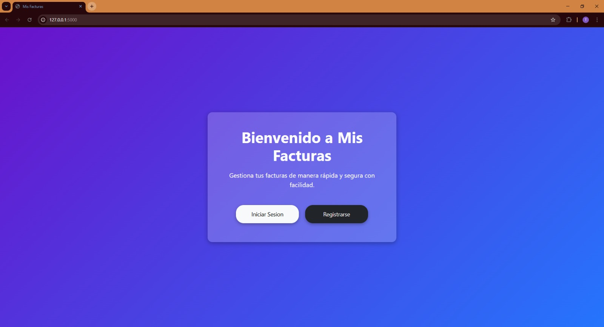
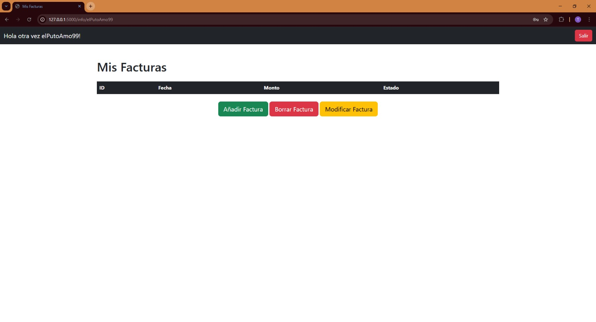

# Proyecto Facturas

### Pantalla de inicio


### Vista de facturas

Este es un proyecto de una aplicación web para gestionar facturas, utilizando **Flask** como framework, **SQLite** para la base de datos, y **Flask-Login** para la gestión de usuarios.

## Características

- **Registro de Usuarios**: Los usuarios pueden registrarse en la aplicación.
- **Inicio de Sesión**: Los usuarios pueden iniciar sesión para ver y gestionar sus facturas.
- **Gestión de Facturas**: Los usuarios pueden ver sus facturas, agregar nuevas, editarlas y eliminarlas.
- **Logout**: Los usuarios pueden cerrar sesión de manera segura.

## Tecnologías

- **Flask**: Framework web en Python.
- **SQLite**: Base de datos ligera y fácil de usar.
- **Flask-Login**: Gestión de usuarios y autenticación.
- **Flask-WTF**: Formularios seguros.
- **Flask-Bootstrap**: Para estilos de interfaz web.
- **Flask-CKEditor**: Para edición de texto enriquecido.

## Requisitos

Antes de ejecutar la aplicación, asegúrate de tener instaladas las siguientes dependencias:

- **Python** 3.8 o superior.
- **Pip** para instalar las dependencias.

## Instalación

1. **Clona el repositorio**:

   ```bash
   git clone https://github.com/tu_usuario/proyecto_facturas.git
   cd proyecto_facturas
